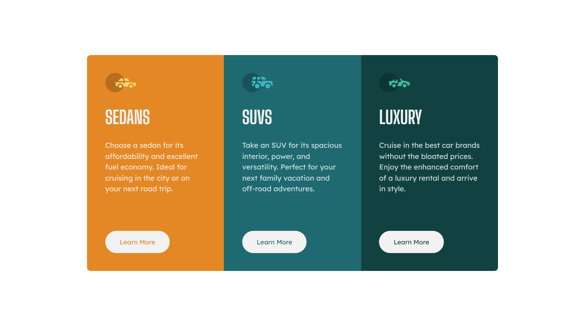

# Frontend Mentor - 3-column preview card component solution

This is a solution to the [3-column preview card component challenge on Frontend Mentor](https://www.frontendmentor.io/challenges/3column-preview-card-component-pH92eAR2-). Frontend Mentor challenges help you improve your coding skills by building realistic projects. 

## Table of contents

- [Frontend Mentor - 3-column preview card component solution](#frontend-mentor---3-column-preview-card-component-solution)
  - [Table of contents](#table-of-contents)
  - [Overview](#overview)
    - [The challenge](#the-challenge)
    - [Screenshot](#screenshot)
    - [Links](#links)
  - [My process](#my-process)
    - [Built with](#built-with)
    - [What I learned](#what-i-learned)
    - [Continued development](#continued-development)
  - [Author](#author)

## Overview

### The challenge

Users should be able to:

- View the optimal layout depending on their device's screen size
- See hover states for interactive elements

### Screenshot

### Links

- Solution URL: [https://github.com/delacruzralph/Front-End-Mentor-Challenges/tree/master/3-column-preview-card-component-main](https://github.com/delacruzralph/Front-End-Mentor-Challenges/tree/master/3-column-preview-card-component-main)
- Live Site URL: [https://delacruzralph.github.io/Front-End-Mentor-Challenges/3-column-preview-card-component-main/](https://delacruzralph.github.io/Front-End-Mentor-Challenges/3-column-preview-card-component-main/)

## My process

I started with HTML and organizing the information. I then laid out the columns and container on the page so it is centered and sized appropriately. Then I styled the individual pieces. For layout in desktop view, I started off with flexbox but realized using grid would make sense in this case.

### Built with

- HTML/CSS
- Flexbox
- CSS Grid

**Note: These are just examples. Delete this note and replace the list above with your own choices**

### What I learned

I am still getting used to being flexible with the designs since it is more optimal to consider responsiveness. I learned that flexbox is not the only way to go for making layouts and that grid works great in different cases. 

### Continued development

I am more comfortable with just writing code now, so I would like to continue practicing and creating pages with more content. I think the components are great practice, but working on larger projects would be helpful in seeing how web development comes together.

## Author

- Website - [Ralph Dela Cruz](https://ralphlewisdelacruz.wixsite.com/ralph)
- Frontend Mentor - [@delacruzralph](https://www.frontendmentor.io/profile/delacruzralph)
