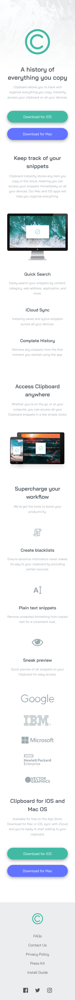

# Frontend Mentor - Clipboard landing page solution

This is a solution to the [Clipboard landing page challenge on Frontend Mentor](https://www.frontendmentor.io/challenges/clipboard-landing-page-5cc9bccd6c4c91111378ecb9). Frontend Mentor challenges help you improve your coding skills by building realistic projects. 

## Table of contents

- [Frontend Mentor - Clipboard landing page solution](#frontend-mentor---clipboard-landing-page-solution)
  - [Table of contents](#table-of-contents)
  - [Overview](#overview)
    - [The challenge](#the-challenge)
    - [Screenshot](#screenshot)
    - [Links](#links)
  - [My process](#my-process)
    - [Built with](#built-with)
    - [What I learned](#what-i-learned)
    - [Continued development](#continued-development)
    - [Useful resources](#useful-resources)
  - [Author](#author)

**Note: Delete this note and update the table of contents based on what sections you keep.**

## Overview

### The challenge

Users should be able to:

- View the optimal layout for the site depending on their device's screen size
- See hover states for all interactive elements on the page

### Screenshot




### Links

- Solution URL: [Github Repository](https://github.com/delacruzralph/Front-End-Mentor-Challenges/tree/master/clipboard-landing-page-master)
- Live Site URL: [Live Website](https://delacruzralph.github.io/Front-End-Mentor-Challenges/clipboard-landing-page-master/)

## My process

For this challenge, which was the first full web page I've done, I had to take a step back and carefully look at the design, especially for organizing the HTML. I actually reset this challenge after rushing in and not organizing properly and grouping elements together, which made things harder when trying to make the web page responsive. The next time around, I was able to style the mobile web page by the usual steps of styling each piece. Afterward, I did the same for the desktop page and styled the elements that needed to change, one at a time. It was easy to get overwhelmed but focusing on one thing at a time helped.

### Built with

- Semantic HTML5 markup
- CSS custom properties
- Flexbox
- CSS Grid
- Mobile-first workflow

### What I learned

I learned how important organization is, not just HTML but also my CSS styles. I practiced using classes to create consistent text blocks and their spacing. Overall, I also learned the complexities of creating an actual web page as opposed to individual components that I was making in previous challenge, especially with the layout.


```css
.heading-paragraph {
  width: min(100%, 40rem);
  margin-block: 3rem;
}

.heading-paragraph p {
  margin-top: 1em;
}
```

### Continued development

I would like to continue practicing creating web pages and messing around with layout tools like Grid and Flexbox. I also got to practice using min() and I am getting a feel for how powerful it is for responsiveness and would like to continue working with it and the other related functions. 

### Useful resources

- [Filter Generator](https://codepen.io/sosuke/pen/Pjoqqp) - This helped me generate a filter so that the SVG Icons can change color on hover.

## Author

- Github - [Ralph Dela Cruz](https://github.com/delacruzralph/)
- Frontend Mentor - [@delacruzralph](https://www.frontendmentor.io/profile/delacruzralph)