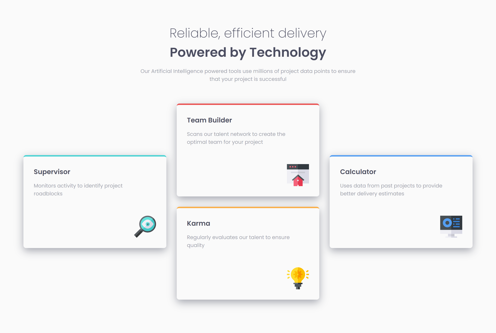
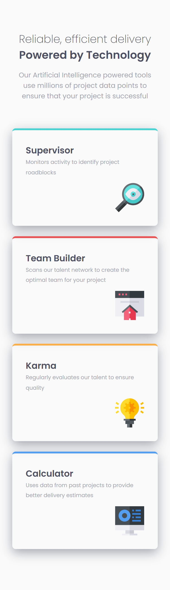

# Frontend Mentor - Four card feature section solution

This is a solution to the [Four card feature section challenge on Frontend Mentor](https://www.frontendmentor.io/challenges/four-card-feature-section-weK1eFYK). Frontend Mentor challenges help you improve your coding skills by building realistic projects. 

## Table of contents

- [Frontend Mentor - Four card feature section solution](#frontend-mentor---four-card-feature-section-solution)
  - [Table of contents](#table-of-contents)
  - [Overview](#overview)
    - [The challenge](#the-challenge)
    - [Screenshot](#screenshot)
    - [Links](#links)
  - [My process](#my-process)
    - [Built with](#built-with)
    - [What I learned](#what-i-learned)
    - [Continued development](#continued-development)
    - [Useful resources](#useful-resources)
  - [Author](#author)

**Note: Delete this note and update the table of contents based on what sections you keep.**

## Overview

### The challenge

Users should be able to:

- View the optimal layout for the site depending on their device's screen size

### Screenshot




### Links

- Solution URL: [https://github.com/delacruzralph/Front-End-Mentor-Challenges/tree/master/four-card-feature-section-master](https://github.com/delacruzralph/Front-End-Mentor-Challenges/tree/master/four-card-feature-section-master)
- Live Site URL: [https://delacruzralph.github.io/Front-End-Mentor-Challenges/four-card-feature-section-master/](https://delacruzralph.github.io/Front-End-Mentor-Challenges/four-card-feature-section-master/)

## My process

At first, I had to think about how to organize the page since the desktop version had an interesting grid. However, I focused on the mobile view and did the usual set up and individual styling. When I finished all that, I moved on to using CSS Grid for the layout.

### Built with

- Semantic HTML5 markup
- CSS custom properties
- CSS Grid
- Mobile-first workflow

**Note: These are just examples. Delete this note and replace the list above with your own choices**

### What I learned

I have a better grasp of CSS Grid and using the column and row numbers to create the layout I want.

To see how you can add code snippets, see below:


```css
  section {
    display: grid;
    grid-template-columns: 1fr 1fr 1fr;
    grid-auto-rows: 8rem;
    gap: 2rem;
  }

  .supervisor {
    grid-column-start: 1;
    grid-column-end: 2;
    grid-row-start: 2;
    grid-row-end: 4;
  }
```

### Continued development

This project was a great way to start practicing with grid and I want to explore it more in future projects. It doesn't seem too difficult and its application seems very helpful and customizeable to many scenarios. Overall, I am proud of how it turned out and how much better I understand CSS Grid.

### Useful resources

- [CSS Grid](https://developer.mozilla.org/en-US/docs/Web/CSS/grid-column-start) - This helped me for understanding layout and placement with CSS Grid!
- [Box Shadows CSS](https://getcssscan.com/css-box-shadow-examples) - Helpful resources for different kinds of box shadows

## Author

- Github - [Ralph Dela Cruz](https://github.com/delacruzralph/)
- Frontend Mentor - [@delacruzralph](https://www.frontendmentor.io/profile/delacruzralph)