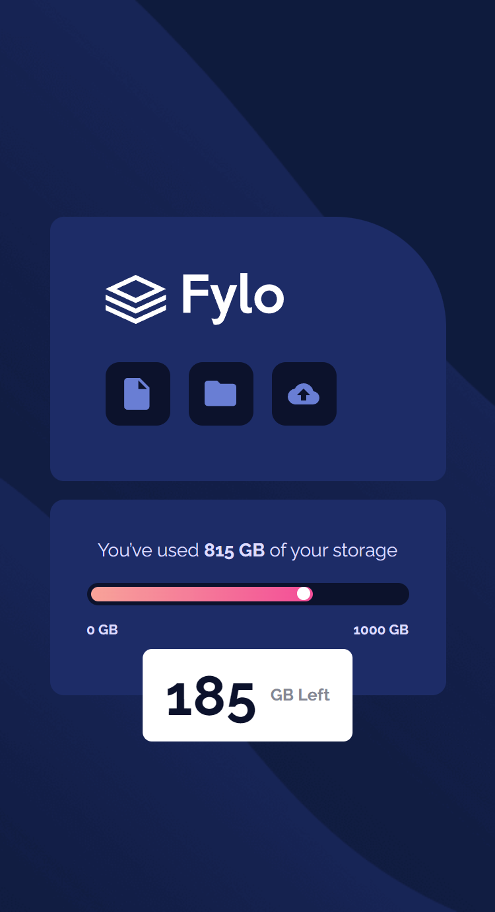
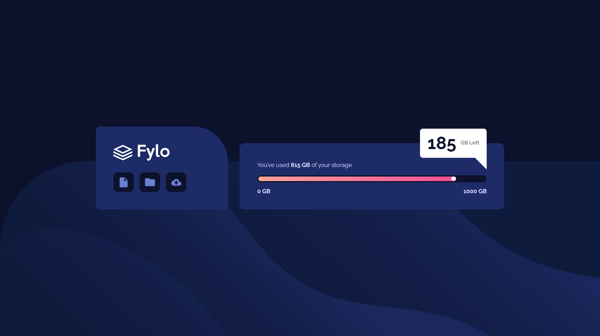

# Frontend Mentor - Fylo data storage component solution

This is a solution to the [Fylo data storage component challenge on Frontend Mentor](https://www.frontendmentor.io/challenges/fylo-data-storage-component-1dZPRbV5n). Frontend Mentor challenges help you improve your coding skills by building realistic projects. 

## Table of contents

- [Frontend Mentor - Fylo data storage component solution](#frontend-mentor---fylo-data-storage-component-solution)
  - [Table of contents](#table-of-contents)
  - [Overview](#overview)
    - [The challenge](#the-challenge)
    - [Screenshot](#screenshot)
    - [Links](#links)
  - [My process](#my-process)
    - [Built with](#built-with)
    - [What I learned](#what-i-learned)
    - [Continued development](#continued-development)
    - [Useful resources](#useful-resources)
  - [Author](#author)

**Note: Delete this note and update the table of contents based on what sections you keep.**

## Overview

### The challenge

Users should be able to:

- View the optimal layout for the site depending on their device's screen size

### Screenshot




### Links

- Solution URL: [https://github.com/delacruzralph/Front-End-Mentor-Challenges/tree/master/fylo-data-storage-component-master](https://github.com/delacruzralph/Front-End-Mentor-Challenges/tree/master/fylo-data-storage-component-master)
- Live Site URL: [https://delacruzralph.github.io/Front-End-Mentor-Challenges/fylo-data-storage-component-master/](https://delacruzralph.github.io/Front-End-Mentor-Challenges/fylo-data-storage-component-master/)

## My process

This challenge was a bit tricky to begin with. I first did some quick HTML organizing and then went onto styling. The most difficult part of this challenge was layouts and placement of items on the page. 

### Built with

- Semantic HTML5 markup
- CSS custom properties
- Flexbox
- CSS Grid
- Mobile-first workflow

### What I learned

I spent a long time trying to perfect the 3 icons in the design. The main pain point was making sure each box was the same size and the second was center aligning the icons. I tried it out with flexbox first, which successfully stretched the height of the boxes and center aligned the items. The problem was the widths were affected by the icons (and I'm sure the height could've also been affected given larger icons). This showed me an instance in which CSS Grid would be a better option, since it is more robust and does not depend as heavily on the content inside it for sizing.

I also used the min() property to size the overall content of the page, allowing it to shrink and grow but limiting it at certain point.
```css
/* Stretched and aligned items vertically using FlexBox */
.icon-group {
  display: flex;
  align-items: stretch;
}

.icon-container {
  display: flex;
  align-items: center;
}

/* Layout and icon alignment using Grid (better choice because layout did not depend on content, more robust)*/
.icon-group {
  display: grid;
  grid-template-columns: repeat(3, 3.5rem);
}

.icon-container {
  display: grid;
  place-content: center;
}

/* Centering items & Adjusting the size of content*/
 body {
  display: grid;
  place-content: center;
  min-height: 100vh;

  grid-template-columns: min(80%, 70rem);
 }
```

### Continued development

Although challenging, I enjoyed working on this one and feel excited about what's to come. I've learned about positioning elements in this one and I am starting to feel more confident with it. 

### Useful resources

- [CSS Reset](https://www.joshwcomeau.com/css/custom-css-reset/) - From one of my feedbacks, a CSS Reset was suggested so I used this resource they sent.

## Author

- Github - [Ralph Dela Cruz](https://github.com/delacruzralph/)
- Frontend Mentor - [@delacruzralph](https://www.frontendmentor.io/profile/delacruzralph)