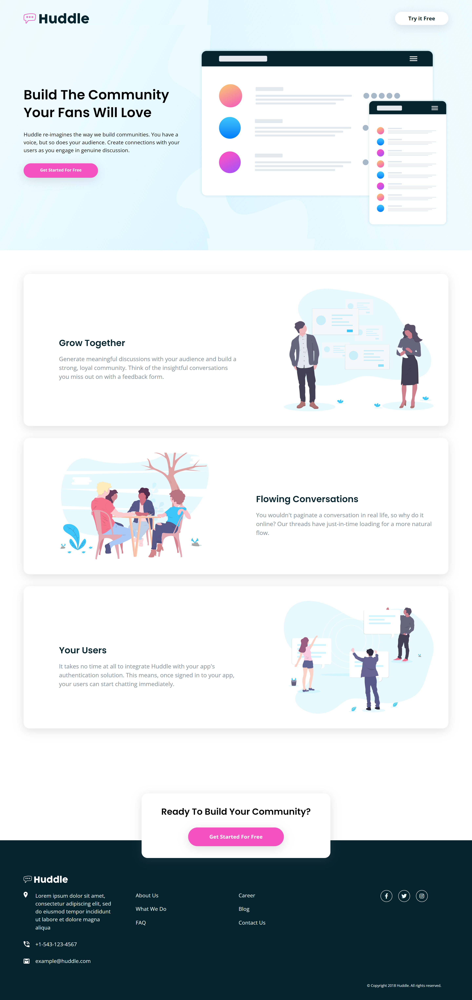
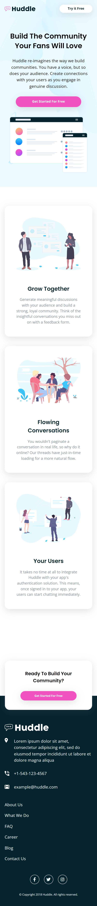

# Frontend Mentor - Huddle landing page with alternating feature blocks solution

This is a solution to the [Huddle landing page with alternating feature blocks challenge on Frontend Mentor](https://www.frontendmentor.io/challenges/huddle-landing-page-with-alternating-feature-blocks-5ca5f5981e82137ec91a5100). Frontend Mentor challenges help you improve your coding skills by building realistic projects. 

## Table of contents

- [Frontend Mentor - Huddle landing page with alternating feature blocks solution](#frontend-mentor---huddle-landing-page-with-alternating-feature-blocks-solution)
  - [Table of contents](#table-of-contents)
  - [Overview](#overview)
    - [The challenge](#the-challenge)
    - [Screenshot](#screenshot)
    - [Links](#links)
  - [My process](#my-process)
    - [Built with](#built-with)
    - [What I learned](#what-i-learned)
    - [Continued development](#continued-development)
  - [Author](#author)

## Overview

### The challenge

Users should be able to:

- View the optimal layout for the site depending on their device's screen size
- See hover states for all interactive elements on the page

### Screenshot

### Links

- Solution URL: [Github](https://github.com/delacruzralph/Front-End-Mentor-Challenges/tree/master/huddle-landing-page-with-alternating-feature-blocks-master)
- Live Site URL: [Website](https://delacruzralph.github.io/Front-End-Mentor-Challenges/huddle-landing-page-with-alternating-feature-blocks-master/)

## My process

This one took a bit of time... However, I felt like I understood how to do what I needed to do. The mobile design was not too hard to code but organizing the HTML so that the desktop design could be made was an important step. 

### Built with

- Semantic HTML5 markup
- CSS custom properties
- Flexbox
- CSS Grid
- Mobile-first workflow

### What I learned

I learned the difficulties of translating mobile to desktop websites. 

### Continued development

I hope to learn more about best practices for responsive web design instead of just media querying everything. 

## Author

- Github - [Ralph Dela Cruz](https://github.com/delacruzralph/)
- Frontend Mentor - [@delacruzralph](https://www.frontendmentor.io/profile/delacruzralph)