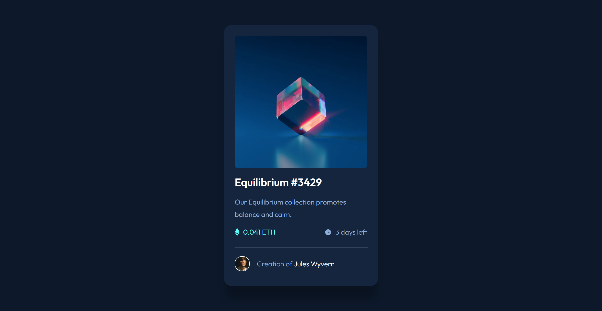

# Frontend Mentor - NFT preview card component solution

This is a solution to the [NFT preview card component challenge on Frontend Mentor](https://www.frontendmentor.io/challenges/nft-preview-card-component-SbdUL_w0U). Frontend Mentor challenges help you improve your coding skills by building realistic projects. 

## Table of contents

- [Frontend Mentor - NFT preview card component solution](#frontend-mentor---nft-preview-card-component-solution)
  - [Table of contents](#table-of-contents)
  - [Overview](#overview)
    - [The challenge](#the-challenge)
    - [Screenshot](#screenshot)
    - [Links](#links)
  - [My process](#my-process)
    - [Built with](#built-with)
    - [What I learned](#what-i-learned)
    - [Continued development](#continued-development)
  - [Author](#author)

## Overview

### The challenge

Users should be able to:

- View the optimal layout depending on their device's screen size
- See hover states for interactive elements

### Screenshot



### Links

- Solution URL: [https://github.com/delacruzralph/Front-End-Mentor-Challenges/blob/master/nft-preview-card-component-main/index.html](https://github.com/delacruzralph/Front-End-Mentor-Challenges/blob/master/nft-preview-card-component-main/index.html)
- Live Site URL: [https://delacruzralph.github.io/Front-End-Mentor-Challenges/nft-preview-card-component-main/](https://delacruzralph.github.io/Front-End-Mentor-Challenges/nft-preview-card-component-main/)

## My process

As usual, I started off by organizing the HTML along with the information. I then worked on styling the smaller pieces, but started to work on the layout in the middle, which made the workflow a bit messy. However, I did start mobile-first which helped a lot. I did some practice with rem although I'm not sure I fully understand it nor do I think that this component needed it. Since it is the same mobile and desktop view, I don't think using proportional measurements was necessary. 
### Built with

- HTML & CSS
- Flexbox
- Mobile-first workflow

### What I learned

I learned how to make an overlay appear on hover and how to utilize position: relative and absolute to set it at the proper location fully on top of the image. I also used it to center the eye icon onto the overlay after hovering on the image. I also used min-width to maintain the size after the screen got larger which helped with responsiveness. 

```css
.image-container {
  border-radius: 0.5rem;
  cursor: pointer;
  position: relative;
}

.overlay {
  border-radius: 0.5rem;
  position: absolute;
  top: 0;
  bottom: 0;
  left: 0;
  right: 0;
  height: 100%;
  width: 100%;
  opacity: 0;
  transition: opacity .15s;
  background-color: hsl(178, 100%, 50%);
}

.eye-icon {
  position: absolute;
  top: 50%;
  left: 50%;
  transform: translate(-24px, -24px);
  z-index: 100;
  opacity: 0;
}
```

### Continued development

I want to continue working with em/rem and also percentages for sizing. I didn't find it necessary for this project since the component didn't really change for different screens.

## Author

- Website - [Ralph Dela Cruz](https://ralphlewisdelacruz.wixsite.com/ralph)
- Frontend Mentor - [@delacruzralph](https://www.frontendmentor.io/profile/delacruzralph)

