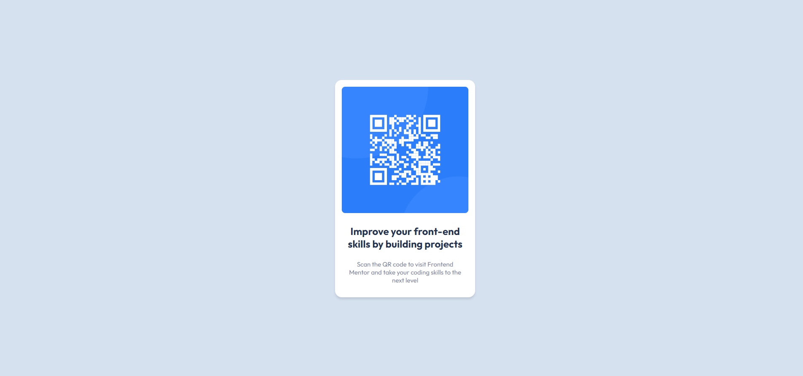

# Frontend Mentor - QR code component solution

This is a solution to the [QR code component challenge on Frontend Mentor](https://www.frontendmentor.io/challenges/qr-code-component-iux_sIO_H). Frontend Mentor challenges help you improve your coding skills by building realistic projects. 

## Table of contents

- [Frontend Mentor - QR code component solution](#frontend-mentor---qr-code-component-solution)
  - [Table of contents](#table-of-contents)
  - [Overview](#overview)
    - [Screenshot](#screenshot)
    - [Links](#links)
  - [My process](#my-process)
    - [Built with](#built-with)
    - [What I learned](#what-i-learned)
    - [Continued development](#continued-development)
  - [Author](#author)

**Note: Delete this note and update the table of contents based on what sections you keep.**

## Overview

### Screenshot

### Links

- Solution URL: [Add solution URL here](https://github.com/delacruzralph/Front-End-Mentor-Challenges/blob/master/qr-code-component-main/index.html)
- Live Site URL: [Add live site URL here](https://delacruzralph.github.io/Front-End-Mentor-Challenges/qr-code-component-main/)

## My process

I started by organizing the information in HTML and then edited the styles piece by piece to match the design and completed the layout last.

### Built with

- HTML
- CSS

### What I learned

I learned how to start creating mini projects like this one and uploading them to a GitHub repository and GitHub page.

### Continued development

I want to continue learning about layouts and the best practices for creating them.

## Author

- Website - [Ralph Dela Cruz](https://ralphlewisdelacruz.wixsite.com/ralph)
- Frontend Mentor - [@delacruzralph](https://www.frontendmentor.io/profile/delacruzralph)
