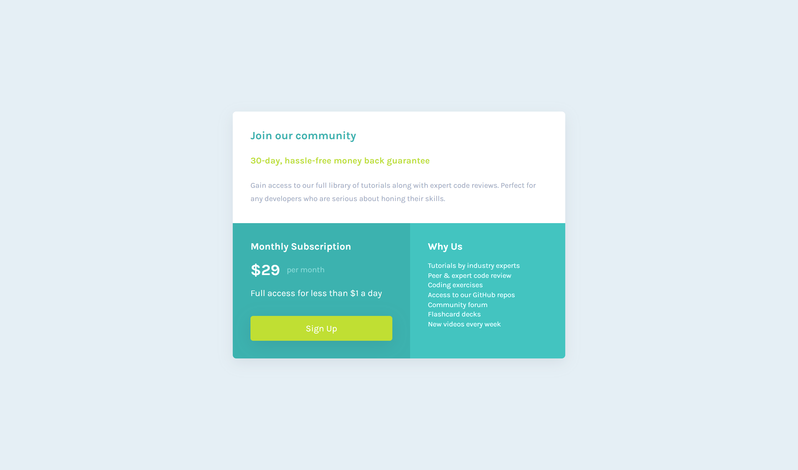

# Frontend Mentor - Single price grid component solution

This is a solution to the [Single price grid component challenge on Frontend Mentor](https://www.frontendmentor.io/challenges/single-price-grid-component-5ce41129d0ff452fec5abbbc). Frontend Mentor challenges help you improve your coding skills by building realistic projects. 

## Table of contents

- [Frontend Mentor - Single price grid component solution](#frontend-mentor---single-price-grid-component-solution)
  - [Table of contents](#table-of-contents)
  - [Overview](#overview)
    - [The challenge](#the-challenge)
    - [Screenshot](#screenshot)
    - [Links](#links)
  - [My process](#my-process)
    - [Built with](#built-with)
    - [What I learned](#what-i-learned)
    - [Continued development](#continued-development)
  - [Author](#author)

**Note: Delete this note and update the table of contents based on what sections you keep.**

## Overview

### The challenge

Users should be able to:

- View the optimal layout for the component depending on their device's screen size
- See a hover state on desktop for the Sign Up call-to-action

### Screenshot




### Links

- Solution URL: [https://github.com/delacruzralph/Front-End-Mentor-Challenges/tree/master/single-price-grid-component-master](https://github.com/delacruzralph/Front-End-Mentor-Challenges/tree/master/single-price-grid-component-master)
- Live Site URL: [https://delacruzralph.github.io/Front-End-Mentor-Challenges/single-price-grid-component-master/](https://delacruzralph.github.io/Front-End-Mentor-Challenges/single-price-grid-component-master/)

## My process

I spent a little more time looking at the layout and processed each piece. Otherwise, it was pretty straightforward HTML organization and then CSS styling. 
### Built with

- Semantic HTML5 markup
- CSS custom properties
- Flexbox
- CSS Grid
- Mobile-first workflow
### What I learned

I got to use grid-template-areas which was easier than setting up rows and columns manually. 

```css
main {
    min-width: 600px;
    margin: 10% 30%;
    display: grid;
    grid-template-areas: 
      "join-our-community join-our-community"
      "monthly-subscription why-us";
  }
```

### Continued development

I will continue practicing with CSS grids for layouts.

## Author

- Website - [Ralph Dela Cruz](https://github.com/delacruzralph)
- Frontend Mentor - [@delacruzralph](https://www.frontendmentor.io/profile/delacruzralph)
