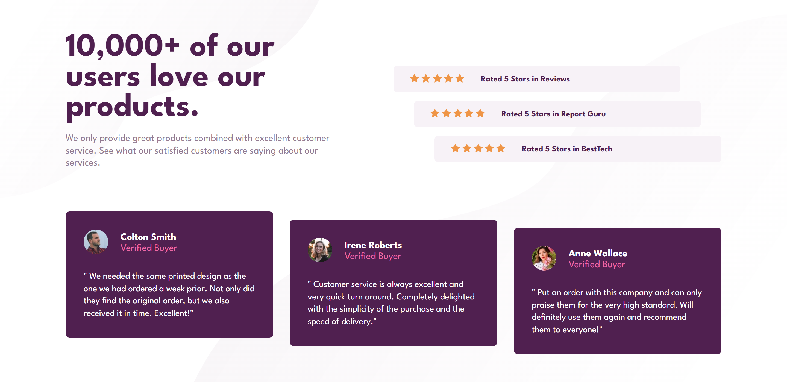

# Frontend Mentor - Social proof section solution

This is a solution to the [Social proof section challenge on Frontend Mentor](https://www.frontendmentor.io/challenges/social-proof-section-6e0qTv_bA). Frontend Mentor challenges help you improve your coding skills by building realistic projects. 

## Table of contents

- [Frontend Mentor - Social proof section solution](#frontend-mentor---social-proof-section-solution)
  - [Table of contents](#table-of-contents)
  - [Overview](#overview)
    - [The challenge](#the-challenge)
    - [Screenshot](#screenshot)
    - [Links](#links)
  - [My process](#my-process)
    - [Built with](#built-with)
    - [What I learned](#what-i-learned)
    - [Continued development](#continued-development)
    - [Useful resources](#useful-resources)
  - [Author](#author)

**Note: Delete this note and update the table of contents based on what sections you keep.**

## Overview

### The challenge

Users should be able to:

- View the optimal layout for the section depending on their device's screen size

### Screenshot




### Links

- Solution URL: [https://github.com/delacruzralph/Front-End-Mentor-Challenges/tree/master/social-proof-section-master](https://github.com/delacruzralph/Front-End-Mentor-Challenges/tree/master/social-proof-section-master)
- Live Site URL: [https://delacruzralph.github.io/Front-End-Mentor-Challenges/social-proof-section-master/](https://delacruzralph.github.io/Front-End-Mentor-Challenges/social-proof-section-master/)

## My process

Since this was the first project that involved actual page layout, it was trickier than before to organize the content. As usual, I started off by organizing the HTML and split up the page into smaller, digestible sections. This helped a lot when I had to account for responsiveness for desktops. I was able to use the sections I previously divided to organize layout for a larger screen. For styling, the process was similar to other projects which was to simply match the design. 

### Built with

- Semantic HTML5 markup
- CSS custom properties
- Flexbox
- CSS Grid
- Mobile-first workflow

### What I learned

I was able to start incorporating CSS Grid into this project and it helped me understand how to use it. I also tried to use more HTML semantics for organizing the page and the type of content each section involved.

```html
  <section class="ratings-section">
    <article id="reviews" class="rating">
```
```css
 .top {
        display: grid;
        grid-template-columns: 1fr 1fr;
        gap: 10rem;
    }
```

### Continued development

I think it is better practice to use semantic HTML elements and I will continue specifying elements on pages. I am also more open to using grid in combination with flexbox and would like to explore the applications of each. I think that specifically for CSS Grid, there are ways to adjust positioning of grid elements instead of the way I did it through transformations.

### Useful resources

- [CSS Grid](https://css-tricks.com/snippets/css/complete-guide-grid/) - This is a good resource that I would like to use in order to explore CSS Grid.

## Author

- Github - [Ralph Dela Cruz](https://github.com/delacruzralph/)
- Frontend Mentor - [@delacruzralph](https://www.frontendmentor.io/profile/delacruzralph)