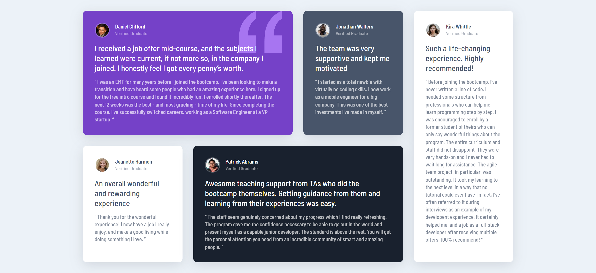
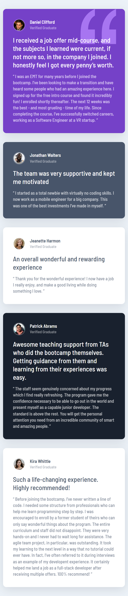

# Frontend Mentor - Testimonials grid section solution

This is a solution to the [Testimonials grid section challenge on Frontend Mentor](https://www.frontendmentor.io/challenges/testimonials-grid-section-Nnw6J7Un7). Frontend Mentor challenges help you improve your coding skills by building realistic projects. 

## Table of contents

- [Frontend Mentor - Testimonials grid section solution](#frontend-mentor---testimonials-grid-section-solution)
  - [Table of contents](#table-of-contents)
  - [Overview](#overview)
    - [The challenge](#the-challenge)
    - [Screenshot](#screenshot)
    - [Links](#links)
  - [My process](#my-process)
    - [Built with](#built-with)
    - [What I learned](#what-i-learned)
    - [Continued development](#continued-development)
    - [Useful resources](#useful-resources)
  - [Author](#author)

**Note: Delete this note and update the table of contents based on what sections you keep.**

## Overview

### The challenge

Users should be able to:

- View the optimal layout for the site depending on their device's screen size

### Screenshot

### Links

- Solution URL: [https://github.com/delacruzralph/Front-End-Mentor-Challenges/tree/master/testimonials-grid-section-main](https://github.com/delacruzralph/Front-End-Mentor-Challenges/tree/master/testimonials-grid-section-main)
- Live Site URL: [https://delacruzralph.github.io/Front-End-Mentor-Challenges/testimonials-grid-section-main/](https://delacruzralph.github.io/Front-End-Mentor-Challenges/testimonials-grid-section-main/)

## My process

For this challenge, since it involved multiple components as opposed to previous challenges, I took it one piece at a time. I focused on the first box, organizing the html, and then styling it. Afterwards, lay out of that same container. I then moved on to the other ones and then finished overall layout after everything was styled.

### Built with

- Semantic HTML5 markup
- CSS custom properties
- Flexbox
- CSS Grid
- Mobile-first workflow

### What I learned

I took my time on this one to learn and process what I was doing. I practiced more of CSS Grid and saw how powerful it is for layouts.

### Continued development

This was a good start to Junior challenges which the rest are full web pages. I am excited to tackle them on, especially with more comfortability with CSS Grid.

### Useful resources

- [Example resource 1](https://www.example.com) - This helped me for XYZ reason. I really liked this pattern and will use it going forward.
- [Example resource 2](https://www.example.com) - This is an amazing article which helped me finally understand XYZ. I'd recommend it to anyone still learning this concept.

**Note: Delete this note and replace the list above with resources that helped you during the challenge. These could come in handy for anyone viewing your solution or for yourself when you look back on this project in the future.**

## Author

- Github - [Ralph Dela Cruz](https://github.com/delacruzralph/)
- Frontend Mentor - [@delacruzralph](https://www.frontendmentor.io/profile/delacruzralph)